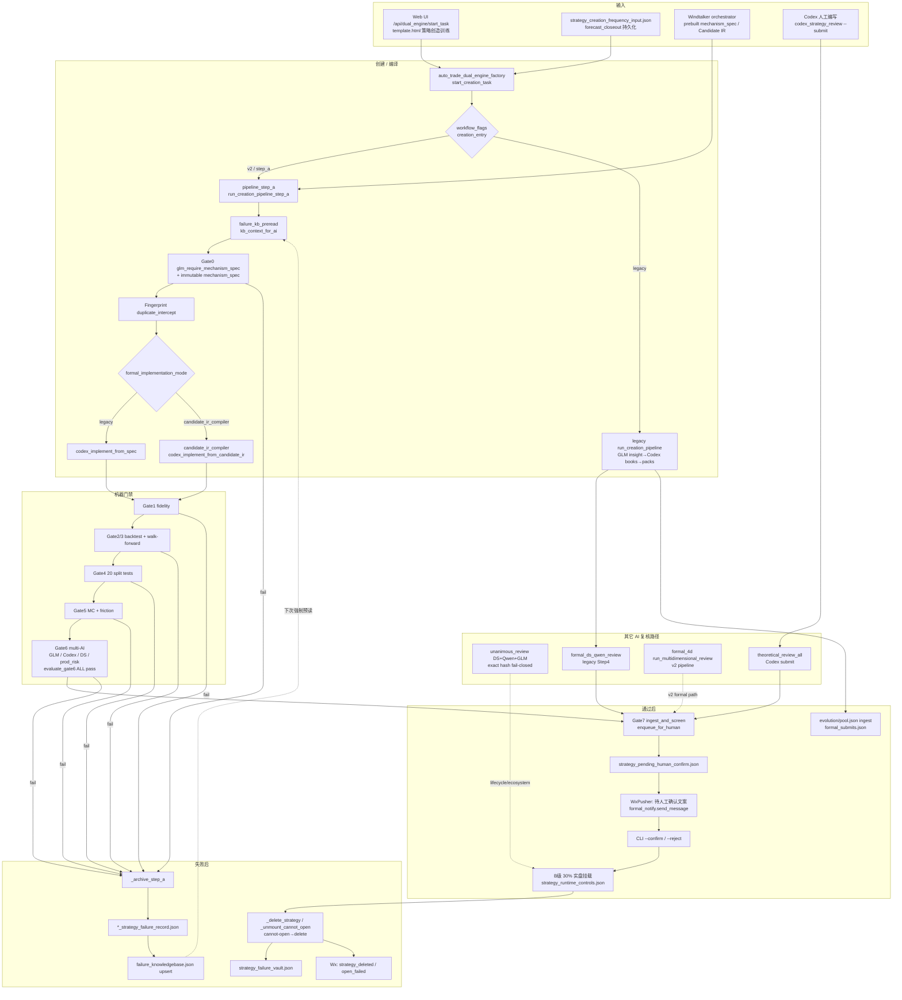

# 只读审计：策略创建全景映射（Strategy Lifecycle Mapping）

- **审计时间**: 2026-07-29  
- **范围**: 本地 `intraday_live_v1_20260720` + 生产 SSH 只读（`root@64.176.47.192`，仅 `ls`/`cat`/`grep`/`python3 -c`）  
- **约束确认**: **无任何既有文件改动**；本报告为唯一新增交付物。  
- **files_modified_beyond_report**: `none`（仅新增本报告）

---

## 0. 生产现状快照（只读）

| 项 | 生产路径/值 |
|---|---|
| `creation_entry` | `v2`（`/root/auto_trade/dual_engine/workflow_flags.json`，acceptance A–H 全 true） |
| 主创建入口 | `start_creation_task` → `start_creation_task_step_a`（STEP A Gates 0–7） |
| Failure KB | `/root/auto_trade/dual_engine/workflow_v2/failure_knowledgebase.json`（37 records 索引；blocked_paths=9, blocked_families=14, lessons=17） |
| Failure records | `/root/auto_trade/dual_engine/workflow_v2/failure_records/*_strategy_failure_record.json`（37 文件） |
| Pending human | `/root/auto_trade/strategy_pending_human_confirm.json` |
| Creation input | `/root/auto_trade/strategy_creation_frequency_input.json`（schema `qiyu_strategy_creation_frequency_input_v2`） |
| AI env（仅键名） | `/root/auto_trade/ai_ecosystem.env`：`QIYU_DEEPSEEK_*` / `QIYU_QWEN_*` / `QIYU_GLM_*` |
| Consent | `/root/auto_trade/ai_research_consent.json`（providers: deepseek/qwen/glm；scopes 含 strategy_research / final_review） |
| Windtalker 产物 | `/root/auto_trade/windtalker_phase{1..5}/`；compiler: `/root/auto_trade/windtalker_phase4/scripts/candidate_ir_compiler.py` |
| Legacy 三AI造策略工厂 | `auto_trade_strategy_creation_factory.py` 已 **DISABLED**（`disabled_ai_creation`，2026-07-24） |

---

## 1. 核心文件与函数映射列表

### 1.1 策略创建全流水线（用户请求 → 生成 → 编译）

| 阶段 | 文件（本地镜像 / 生产同名） | 函数 / 入口 | 角色 |
|---|---|---|---|
| Web UI 触发 | `web_server.py` + `template.html` | `api_dual_engine_start_task` → `dual.start_creation_task`；UI `#strategyCreatorModule` / `fetch('/api/dual_engine/start_task')` | 用户从浏览器启动双引擎任务 |
| 频率/缺口输入 | `auto_trade_forecast_closeout.py` | `build_strategy_creation_frequency_input` / `persist_strategy_creation_frequency_input` | 写入 `/root/auto_trade/strategy_creation_frequency_input.json`；`collect_inputs` 读取 |
| 双引擎总控 | `auto_trade_dual_engine_factory.py` | `start_creation_task` / `_workflow_entry` / `run_creation_pipeline`（legacy） | 按 `workflow_flags.creation_entry` 路由；生产=`v2`→STEP A |
| STEP A 主管道 | `dual_engine_workflow_v2/pipeline_step_a.py` | `run_creation_pipeline_step_a` / `start_creation_task_step_a` | Gates 0–7；失败归档；Gate7 推人工确认 |
| GLM 出机制 | 同上 | `glm_require_mechanism_spec` | Gate0：强制完整 `mechanism_spec`；注入 `failure_kb` 上下文 |
| mechanism_spec 规范化 | `dual_engine_workflow_v2/mechanism_spec.py` | `normalize_mechanism_spec` / `save_immutable_mechanism_spec` | 字段校验 + 不可变落盘 `workflow_v2/mechanism_specs/` |
| 指纹去重 | `dual_engine_workflow_v2/step_a_fingerprint.py` | `build_step_a_fingerprint` / `duplicate_intercept` | 编码前拦截重复机制 |
| Codex 编译（legacy 模板） | `pipeline_step_a.py` | `codex_implement_from_spec` | mechanism_spec → DSL（OHLC+vol_z/atr 族分支） |
| Candidate IR 编译 | `windtalker_phase4_deploy/candidate_ir_compiler.py`（产：`…/windtalker_phase4/scripts/`） | `compile_candidate_ir` / `codex_implement_from_candidate_ir` | Phase4+ bridge；`formal_implementation_mode=candidate_ir_compiler`；**FAIL CLOSED，无 legacy fallback** |
| Windtalker 编排 | `windtalker_phase1_orchestrator.py`（及 phase2–5 deploy） | `run_one_candidate` → `run_creation_pipeline_step_a(..., prebuilt_spec_pack=…)` | 预置 mechanism_spec 跑完整 STEP A；不 auto-mount |
| Legacy 三AI造策略 | `auto_trade_strategy_creation_factory.py` | `collaborative_round` / `run_daily_collaborative_round` / `run_manual_accelerate` | **已禁用**；提示改走 Codex + `auto_trade_codex_strategy_review.py --submit` |
| Codex 人工提交 | `auto_trade_codex_strategy_review.py` | `submit_codex_strategy` | safety → `theoretical_review_all` → `ingest_and_screen` |
| 人工确认 CLI | `auto_trade_human_confirm_pipeline.py` | `confirm` / `reject`；`__main__ --confirm/--reject` | Wx 文案内嵌同命令；确认后 B 级 30% 实盘 |

### 1.2 多 AI 复核链

| 场景 / Gate | 文件 | 函数 | 模型分工 | 通过规则 |
|---|---|---|---|---|
| 三方一致复核（生命周期/生态） | `auto_trade_ai_consensus.py` | `review_one` / `unanimous_review` | DS + Qwen + GLM 并行独立 | 全员 `APPROVE` + `candidate_hash` 精确一致；缺密钥/同意书 → REJECT（fail-closed） |
| 理论复核（Codex 提交） | 同上 | `theoretical_review_one` / `theoretical_review_all` | 三方；≥2 健康票可过（infra 缺失可跳过） | 理论胜率≥50 且止损簇风险低；否则 REJECT |
| Dual-engine legacy Step4 | `auto_trade_dual_engine_factory.py` | `formal_ds_qwen_review` | **仅 DeepSeek + Qwen**（各 WR≥50） | `policy=deepseek_and_qwen_formal_only_ge_50` |
| Dual-engine GLM 设计/门控 | 同上 | `glm_market_insight` / `glm_audit_hypotheses` / `glm_internal_gate` / `glm_sim_review` | GLM-5.2 | 内部门；非一致投票 |
| STEP A Gate6 多 AI | `pipeline_step_a.py` + `attackers.py` + `gates.py` | `glm_mechanism_review` / `codex_fidelity_review` / `deepseek_logic_attack` / `production_risk_attack` → `evaluate_gate6` | GLM 机制 / Codex 忠实度 / DS 逻辑攻击 / 生产风险 | **四路均 `pass`，禁止平均分** |
| Workflow v2 4D 正式审 | `dual_engine_workflow_v2/formal_4d.py` | `run_multidimensional_review` | DS 因果 / Qwen 博弈 / 本地回测完整性 / GLM 摩擦 | 四维全过且无 fatal；辅助 WR≥75 **不可覆盖 fatal** |
| Creation factory（已死） | `auto_trade_strategy_creation_factory.py` | `deepseek_propose_directions` → `qwen_generate_drafts` → `glm_attack_drafts` → `qwen_repair_after_attack` | 造策略流水线 | 入口直接 `disabled_ai_creation` |
| 仲裁模块 | `auto_trade_ai_arbitration.py` | `arbitrate_reviews` | — | **已删除**；调用 raise；`unanimous_review` 回退到直接三方投票 |

**API / 环境配置路径（无 secrets）**

| 配置 | 路径 / 变量 |
|---|---|
| Env 文件 | `/root/auto_trade/ai_ecosystem.env`（亦尝试 `/root/ai_ecosystem.env`） |
| 加载器 | `auto_trade_ai_consensus._load_root_only_env`；`auto_trade_dual_engine_factory._load_env` |
| 键名模式 | `QIYU_DEEPSEEK_API_KEY|MODEL|URL|TIMEOUT_SEC`；`QIYU_QWEN_*`；`QIYU_GLM_*` |
| 默认模型 | deepseek-v4-pro；qwen3.7-plus；**glm-5.2**（`open.bigmodel.cn`） |
| 研究同意书 | `/root/auto_trade/ai_research_consent.json`（`QIYU_AI_RESEARCH_CONSENT_FILE` 可覆盖） |
| 同意检查 | `external_research_consent_status` — 每次网络调用前；缺失 fail-closed |

### 1.3 通过 / 失败后动作

| 动作 | 文件 | 函数 | JSON / 落盘路径 |
|---|---|---|---|
| Candidate 进化池 ingest（legacy dual） | `auto_trade_dual_engine_factory.py` | `_ingest_book_to_pool` / `save_pool` | `/root/auto_trade/dual_engine/evolution/pool.json` |
| Formal 提交记录 | 同上 | `_record_formal` | `/root/auto_trade/dual_engine/formal_submits.json` |
| 人工待确认队列 + Wx | `auto_trade_human_confirm_pipeline.py` | `ingest_and_screen` → `enqueue_for_human` → `_wx` | `/root/auto_trade/strategy_pending_human_confirm.json` |
| Wx 发送核心 | `auto_trade_formal_notify.py` | `send_message` / `_send_via_verified_wxpusher` / `format_open_*` | 配置审计于 `auto_trade/formal_notify_*`；通道绑定 `common.send_wx` + WxPusher HTTP |
| 开仓/失败/风控/平仓 Wx | 同上 | `notify_open_success` / `notify_open_failed` / `notify_risk` / `notify_close` | 交易事件文案构建 |
| 管道内开仓 Wx | `auto_trade_human_confirm_pipeline.py` | `notify_open_if_pipeline` | 仅 pipeline 确认策略 |
| 删除策略 + Wx | 同上 | `_delete_strategy` → `_archive_failure` + `_wx(kind=strategy_deleted)` | vault: `/root/auto_trade/strategy_failure_vault.json`；controls: `strategy_runtime_controls.json` |
| C 级淘汰监控 | 同上 | `monitor_live_grades` / `_monitor_live_grades_unlocked` | C 级 3 单 2 止损 → delete |
| cannot-open → 卸载删除 | `auto_trade_strategy_lifecycle.py` | `_unmount_cannot_open`（治理轮内调用） |  scrub daemon configs；`lifecycle_grade=deleted`；避免 forecast「暂停」悬挂 |
| STEP A 失败归档 | `pipeline_step_a.py` | `_archive_step_a` → `build_failure_record` / `save_failure_record` | `…/failure_records/{tid}_strategy_failure_record.json` + upsert KB |
| v2 failure archive | `dual_engine_workflow_v2/failure_archive.py` / `pipeline._archive_fail` | `build_failure_archive` / `store.save_failure_archive` | `workflow_v2/failure_archives.jsonl` 等 |

### 1.4 Failure KB

| 项 | 详情 |
|---|---|
| 核心模块 | `dual_engine_workflow_v2/failure_kb.py` |
| 单条记录路径 | `{WF_DIR}/failure_records/{task_id}_strategy_failure_record.json` |
| KB 聚合路径 | `{WF_DIR}/failure_knowledgebase.json` = `/root/auto_trade/dual_engine/workflow_v2/failure_knowledgebase.json` |
| 写入时机 | 任一 Gate/repair 失败调用 `_archive_step_a` → `save_failure_record` → `_upsert_kb` |
| 记录字段 | `artifact=strategy_failure_record`；`original_mechanism`；`failure_stage`；`failed_tests`；`failure_reason`；`is_*_issue`；`mechanism_drift_occurred`；`repair_count`；`final_verdict`；`reusable_lessons`；`blocked_paths`；`counterexamples_for_future_ai`；`gate_results_summary` |
| 下次 GLM 是否读 KB | **是**：`run_creation_pipeline_step_a` 开头 `kb_context_for_ai()` → `task["failure_kb_preread"]`；注入 `mode_ctx["failure_kb"]`；`glm_require_mechanism_spec` prompt 含 KB；`path_is_blocked` 可在 Gate0 后直接归档 `blocked_by_failure_kb` |
| Windtalker KB | Phase1 delta: `windtalker_phase1_failure_kb_delta.json`；Phase5: `WINDTALKER_PHASE5_FAILURE_KB.json`（独立审计产物，编排器也会 `kb_context_for_ai`） |
| Ecosystem SQLite 失败 | `auto_trade_strategy_intelligence.record_failure` — 生态探针另一路，非 STEP A JSON KB |

---

## 2. 策略生命周期数据流动路径图

---

## 3. 关键链路摘要（按主路径）

### 3.1 生产主路径：Dual Engine STEP A（`creation_entry=v2`）

1. **请求**: Web `/api/dual_engine/start_task` 或 CLI/Windtalker 调用 `start_creation_task`  
2. **路由**: `_workflow_entry()` → `start_creation_task_step_a`  
3. **KB 预读**: `kb_context_for_ai()` 强制注入 GLM  
4. **Gate0**: GLM `mechanism_spec`（或 Windtalker `prebuilt_spec_pack`）→ 规范化/不可变存储 → 指纹拦截  
5. **编译**: `codex_implement_from_spec`（或 Phase4+ `candidate_ir_compiler`）  
6. **Gate1–5**: 忠实度 → 回测/WF → 20 项拆分测试 → MC/摩擦  
7. **Gate6**: 四路独立 AI，**全部 pass**，禁止平均  
8. **Gate7**: `ingest_and_screen(..., require_ai_review=True)` → pending JSON + Wx；**不自动上实盘**（`production_mounted=False`）  
9. **人工**: `python3 auto_trade_human_confirm_pipeline.py --confirm KEY` → B 级 30%  
10. **失败任意门**: `_archive_step_a` → failure record + KB；供下轮 GLM 必读  

### 3.2 Codex 直提路径

`auto_trade_codex_strategy_review.submit_codex_strategy` → safety → `theoretical_review_all`（三 AI）→ `ingest_and_screen` → 同 pending/Wx/人工确认。

### 3.3 已退役路径

- `auto_trade_strategy_creation_factory` 自动/手动造策略：**disabled_ai_creation**  
- `auto_trade_ai_arbitration`：**DELETED**（独立仲裁不可用）  

### 3.4 实盘后淘汰

- 管道监控：降级 / C 级止损簇 → `_delete_strategy` + vault + Wx  
- 生命周期治理：不可开仓 → `_unmount_cannot_open`（静默从 daemon 卸挂 + `deleted`，避免假「暂停」）  

---

## 4. 关键 JSON / 状态路径速查

| 用途 | 绝对路径（生产） |
|---|---|
| Workflow flags | `/root/auto_trade/dual_engine/workflow_flags.json` |
| Dual status / tasks | `/root/auto_trade/dual_engine/status.json`；`…/tasks/{tid}.json` |
| STEP A artifacts | `/root/auto_trade/dual_engine/workflow_v2/artifacts/` |
| Mechanism specs | `/root/auto_trade/dual_engine/workflow_v2/mechanism_specs/` |
| Gate runs | `/root/auto_trade/dual_engine/workflow_v2/gate_runs/` |
| Failure records / KB | `…/failure_records/`；`…/failure_knowledgebase.json` |
| Pending human confirm | `/root/auto_trade/strategy_pending_human_confirm.json` |
| Runtime controls | `/root/auto_trade/strategy_runtime_controls.json` |
| Failure vault | `/root/auto_trade/strategy_failure_vault.json` |
| Creation frequency input | `/root/auto_trade/strategy_creation_frequency_input.json` |
| Formal submits | `/root/auto_trade/dual_engine/formal_submits.json` |
| Evolution pool | `/root/auto_trade/dual_engine/evolution/pool.json` |
| AI env / consent | `/root/auto_trade/ai_ecosystem.env`；`…/ai_research_consent.json` |

---

## 5. 合规声明

- 本审计为 **STRICTLY READ-ONLY**：未对生产或本地既有文件执行写/编辑/部署/git commit/chmod/scp 覆盖。  
- **无任何既有文件改动**（仅新增本报告）。  
- **files_modified_beyond_report: none**  
- 报告路径：`/Users/lele/Documents/Codex/2026-07-12/ru-g/work/intraday_live_v1_20260720/READONLY_AUDIT_STRATEGY_LIFECYCLE_MAPPING.md`
