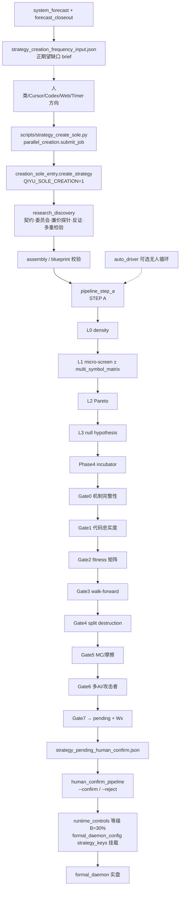

# 只读全景审计：系统最新态（2026-08-02）

- **审计时间**: 2026-08-02 10:47–10:50 CST（生产主机 UTC 02:47 起）
- **本地**: `/Users/lele/Documents/Codex/2026-07-12/ru-g/work/intraday_live_v1_20260720`，分支 `cursor/research-gap-fill-d7e9` @ `02928ff`（2026-08-01 23:12 +0800）
- **生产**: `root@64.176.47.192`（SSH BatchMode 只读：`systemctl` / `ps` / `ss` / `ls` / `python3` 读 JSON）
- **约束**: 无部署、无 daemon 重启、无 git commit；除本报告外无写入
- **对照旧文档**: 本地/生产均有 `QUANT_SYSTEM_PANORAMA_AND_MULTI_AI_INTEGRATION_REPORT.md`（生产 mtime **2026-07-29**）；本地另有 `READONLY_AUDIT_STRATEGY_LIFECYCLE_MAPPING.md`（2026-07-29）。**生产无更新于本报告的只读全景**；本文件为 2026-08-02 最新只读快照。
- **files_modified_beyond_report**: `none`

---

## 1. 一句话现状

生产仍是 **16 路 formal daemon + :8080 Web** 的实盘骨架；创造侧已收敛为 **sole research-discovery → STEP A（L0–L3 funnel + incubator + Gate0–7）→ pending/Wx**，但 **auto_driver / creation-worker 当前无常驻进程**；预测显示周可成交约 **10.66**、已校准正期望周频率 **0.00**（正期望缺口周 **+3.5**）。

---

## 2. 实盘策略清单

来源：各 `formal_daemon_config*.json` 的 `strategy_keys` + `strategy_runtime_controls.json` 等级 + pending/标题交叉。  
Forecast `can_open=6` / `openable_grade_counts={B:6}`；daemon 挂载 **10** 把钥匙（含 4 个 ADA5 clone，未全部进入 forecast 贡献表 — 见注）。

| Daemon | Symbol | TF | Key | 标题 | 等级 | 开仓 | 仓位比 | Forecast 周成交 |
|---|---|---|---|---|---|---|---|---|
| default | BTC-USDT-SWAP | 1h | `frost3_btc1h_xrpport_exhaustion_fade_slope` | 寒霜叁-BTC-1h-exhaustion_fade_xrpport | B | 是 | 0.3 | 0.15 |
| ada_5m | ADA-USDT-SWAP | 5m | `codex0725t3_ada5m_trendpb_r42_z2p3_h14` | ADA5顺势回升 | B | 是 | 0.3 | **8.0** |
| ada_5m | ADA-USDT-SWAP | 5m | `ada5m_bopb_asia_o20_r42_z2p3` | 亚盘高突破回踩再进 | B | 是 | 0.3 | 0.15 |
| btc_5m | BTC-USDT-SWAP | 5m | `btc5_trend_rebound_ada5_clone_v1` | BTC5顺势回升 | B | 是 | 0.3 | （forecast 无行） |
| eth_5m | ETH-USDT-SWAP | 5m | `eth5_trend_rebound_ada5_clone_v1` | ETH5顺势回升 | B | 是 | 0.3 | （forecast 无行） |
| sol_5m | SOL-USDT-SWAP | 5m | `sol5_trend_rebound_ada5_clone_v1` | SOL5顺势回升 | B | 是 | 0.3 | （forecast 无行） |
| xrp_5m | XRP-USDT-SWAP | 5m | `xrp5_trend_rebound_ada5_clone_v1` | XRP5顺势回升 | B | 是 | 0.3 | （forecast 无行） |
| ltc_5m | LTC-USDT-SWAP | 5m | `ltc5_exhaustion_fade_short_ai` | LTC 5分钟冲高衰竭回落（AI创造） | B | 是 | 0.3 | 0.5 |
| ng_5m | NG-USDT-SWAP | 5m | `ng5_exhaustion_fade_short_ai` | NG 5分钟冲高衰竭回落（AI创造） | B | 是 | 0.3 | 2.0 |
| xrp_15m | XRP-USDT-SWAP | 15m | `frost_xrp_rescue_h20_t45` | 寒霜-XRP-15m-exhaustion_fade | B | 是 | 0.3 | 0.5 |

**挂载但空钥匙（监控/待命，allow_auto_open=false）**: btc_15m, cl/cl_5m/cl_15m, ng/ng_15m, xag_5m, xau/xau_5m/xau_15m。

**人工确认队列**（`/root/auto_trade/strategy_pending_human_confirm.json`，mtime **2026-07-31 13:06**）:
- `awaiting_confirm`: `frost3w2g_sol_tp47_h30_r46_c20`、`frost3w2g_sol_tp47_h32_r46_c20`（SOL 1h）
- 其余多为 `confirmed_live_b` / `replaced_offline` / `rejected` 历史项

**注（UNVERIFIED）**: 4 个 `*_trend_rebound_ada5_clone_v1` 已挂载且 runtime=B，但不在 `system_forecast_latest.json` 的 `per_strategy` 六条贡献里；可能因 forecast 刷新过滤/贡献门槛，非本次写读可改动项。

---

## 3. 核心模块 / 目录树（精简）

```
本地 & 生产同构主干
├── web_server.py                          # Flask :8080
├── auto_trade_formal_daemon.py            # 多实例实盘（环境变量 SYMBOL/TF）
├── auto_trade_human_confirm_pipeline.py   # Gate7 后 Wx + --confirm/--reject
├── auto_trade_system_forecast.py          # 系统预测主逻辑
├── auto_trade_forecast_closeout.py        # 周成交/正期望缺口/校准收口
├── auto_trade_ai_consensus.py             # 三 AI（DS/Qwen/GLM）
├── auto_trade_dual_engine_factory.py      # legacy 路由壳；flags→v2/STEP A
├── dual_engine_workflow_v2/               # 创造+审核内核（本地最活跃）
│   ├── creation_sole_entry.py             # 唯一创造入口
│   ├── research_discovery.py              # 研究发现 / 委员会 / 探针阶梯
│   ├── parallel_creation.py               # 双管道队列
│   ├── pipeline_step_a.py                 # STEP A 主管道（L0–L3→incubator→Gates）
│   ├── funnel_l0_density.py … l3_*.py     # Phase3 漏斗
│   ├── fitness_engine.py / incubator.py   # Phase2/4
│   ├── gates.py                           # Gate0–7
│   ├── formal_review_bridge.py / review_admission_v2.py
│   └── research_symbol_policy.py          # 禁研 ADA（不影响已挂载实盘）
├── scripts/
│   ├── strategy_create_sole.py            # CLI 唯一入口
│   └── auto_driver/                       # 无人值守 L0→锚点漏斗驱动（库）
├── auto_driver/                           # 生产副本（/root/auto_driver）
├── auto_trade/                            # 运行时状态 JSON/JSONL
│   ├── formal_daemon_config_*.json
│   ├── strategy_pending_human_confirm.json
│   ├── system_forecast_latest.json
│   ├── strategy_creation_frequency_input.json
│   ├── strategy_runtime_controls.json
│   └── dual_engine/parallel_creation/{pending,running,completed,failed,artifacts}
├── strategy_configs/{experimental,ai_dsl}_strategies.json
├── docs/PRODUCTION_SOURCE_OF_TRUTH.md     # 准入不变量（WR≥65% 等）
├── PHASE2…PHASE6_*_REPORT.md              # 漏斗/孵化器/KB/端到端落地报告
└── windtalker_phase{1..5}_*               # 研究战役产物（非常驻服务）
```

---

## 4. 相对旧全景（2026-07-29）的主要变更

| 主题 | 旧全景/旧映射 | 2026-08-02 最新观察 | 状态 |
|---|---|---|---|
| 创造入口 | `start_creation_task` → STEP A；factory 已禁用 | **强制 sole**：`creation_sole_entry` + `scripts/strategy_create_sole.py`；ecosystem/mass/factory 旁路拒绝 | **已核实（代码+生产文件存在）** |
| research-discovery / gap-fill | 旧文几乎未提 | 分支 `research-gap-fill-d7e9`：机制树、探针预算、事件独立、周频门、禁研 ADA、身份锁定等连续 fix | **已核实（git log + 模块存在）** |
| Funnel L0–L3 + fitness + incubator | PHASE 报告本地有；旧全景仅笼统 STEP A | `pipeline_step_a` 内嵌 L0→L1(±multi_symbol_matrix)→L2→L3→Phase4 incubator→Gate0–7 | **已核实** |
| auto_driver | 旧全景无 | `/root/auto_driver` + config 指向 asia_sweep_fade；**无 tmux/无常驻进程** | **代码在、运行停（核实）** |
| partial_tp / multi_symbol_matrix | 旧文无 | DSL/`pipeline_step_a` 支持 `partial_tp_atr`；auto_driver/pack 可开矩阵 | **已核实（代码）** |
| 三 AI 门 | 理论 WR≥50% | `docs/PRODUCTION_SOURCE_OF_TRUTH.md`：**WR≥65%**、盈利单均净≥5%、周开仓≥0.5（优先 14 日实盘密度） | **已核实（文档+代码路径）** |
| 预测/正期望 | forecast 存在 | closeout：`positive_expectancy_frequency*`；创造 brief **优先正期望缺口** | **已核实（最新 JSON）** |
| 平行创造队列 | 无/弱 | `/root/auto_trade/dual_engine/parallel_creation/` 今日有 completed；pending=0；`qiyu-creation-worker@*` **inactive** | **已核实** |
| Windtalker | Phase1–5 产物 | 仍为研究/部署包，**非 systemd 常驻** | **已核实** |
| ADA5 hist freq replay | — | 本地有 `_tmp_ada5_3ai_weekly_freq.py` 等探针；生产准入以 14d×regime 为权威样例 | **部分 UNVERIFIED（是否仍为定时任务：未见独立 service）** |
| 本地工作区 | 较干净 | 大量未跟踪/修改文件（frost*/windtalker*/scratch）；**勿当作已部署** | **已核实（git status）** |

---

## 5. 创造 / 审核 / 确认数据流



**现行文件路径（此刻存在）**

| 阶段 | 路径 |
|---|---|
| CLI 入口 | `/root/scripts/strategy_create_sole.py`（本地同相对路径） |
| Sole API | `dual_engine_workflow_v2/creation_sole_entry.py` |
| 队列 | `/root/auto_trade/dual_engine/parallel_creation/{pending,running,completed,failed,artifacts}` |
| STEP A | `dual_engine_workflow_v2/pipeline_step_a.py` + `gates.py` + `funnel_l*.py` + `incubator.py` |
| Flags | `/root/auto_trade/dual_engine/workflow_flags.json`（`creation_entry=v2`, `step_a_deployed=true`） |
| Pending | `/root/auto_trade/strategy_pending_human_confirm.json` |
| 确认管道 | `/root/auto_trade_human_confirm_pipeline.py` + timer `qiyu-human-confirm-pipeline` |
| 挂载 | `/root/auto_trade/formal_daemon_config_*.json` + `strategy_runtime_controls.json` |

---

## 6. 运行中进程与关键路径

### 6.1 常驻 / systemd（生产核实）

| 单元 / 进程 | 状态 |
|---|---|
| `qiyu-web.service` → `python3 /root/web_server.py` | **active**，监听 `0.0.0.0:8080` |
| `qiyu-formal-auto-trade*.service` ×16 | **全部 active running**（含 default BTC1h、ADA5、BTC5/ETH5/SOL5/XRP5、LTC5、NG5、XRP15m、以及空钥匙的 CL/NG/XAU/XAG 等） |
| Redis | `127.0.0.1:6379` |
| tmux / screen / auto_driver 进程 | **无** |
| `qiyu-creation-worker@0/1` | loaded **inactive** |
| `qiyu-strategy-creator.timer` | **inactive**（上次 2026-08-01 22:26） |
| `qiyu-strategy-creation-factory.timer` | **disabled** |
| `qiyu-system-forecast.timer` | **enabled**（周一 08:00；另有近期 snapshot 至 10:02） |

活跃辅助 timer（抽样）: human-confirm、open-hunter、presence-watch、strategy-rating、microstructure-collector、execution-cost-calibrator、adaptive-engine、strategy-ecosystem、daily-report 等。

### 6.2 关键时间戳（生产）

| 工件 | 时间（CST） |
|---|---|
| `system_forecast_latest.json` | **2026-08-02 10:04:38**（`generated_at` 09:59:36） |
| `strategy_creation_frequency_input.json` | **2026-08-02 10:04:38** |
| forecast snapshot | 最新 `snapshot_20260802_100246_*.json` |
| `strategy_pending_human_confirm.json` | **2026-07-31 13:06:22** |
| `workflow_flags.json` | 2026-07-30 22:12:31 |
| `web_server.py` | 2026-08-01 22:11 |
| `auto_trade_formal_daemon.py` | 2026-08-02 10:32 |
| 平行创造 completed | 今日至 ~10:03 有新完成件；pending=0 |

### 6.3 指标 / 预测路径（expected WR · weekly fills · positive-E gap）

| 指标 | 现居处 |
|---|---|
| 理论 / 预期胜率 | 准入：`docs/PRODUCTION_SOURCE_OF_TRUTH.md`（≥65%）；队列字段 `ai_theoretical_wr_*`；forecast 行内 `ai_theoretical_wr_avg` + `calibrated_expected_win_rate_pct` |
| 周成交 / 日成交 | `/root/auto_trade/system_forecast_latest.json` → `per_strategy.expected_weekly_fills` / `overall.weekly_opens_expected`（现 **10.6572**） |
| 组合频率与缺口 | 同文件 `frequency_gap` + `portfolio_frequency`；创造输入 `/root/auto_trade/strategy_creation_frequency_input.json` |
| 正期望频率与缺口 | `positive_expectancy_frequency` / `positive_expectancy_frequency_gap`；逻辑在 `auto_trade_forecast_closeout.py`；现 **校准正期望周=0.0**，缺口周 **+3.5**（`creation_brief.target_incremental_weekly_fills=3.5`，`priority=positive_expectancy_frequency_gap`） |
| 校准 / 过期 | `forecast_calibration_weekly.json`、`forecast_stale_flag.json`、`calibration_stage`；快照目录 `auto_trade/forecast_snapshots/` |
| Web | `templates/forecast.html` + web_server forecast API（旧全景已述） |

### 6.4 本地 Git 表面（只读摘要）

- 分支: `cursor/research-gap-fill-d7e9`（领先/分叉于多条创造与 UI 分支）
- HEAD: `02928ff fix: preserve signed volume breakout mechanism`
- 工作区: 多文件已修改未提交 + 大量 untracked（**不等于生产已同步**）
- 相对旧地图的新增 locally-notable: `scripts/auto_driver/`、`dual_engine_workflow_v2/{creation_sole_entry,research_discovery,funnel_l*,incubator,fitness_engine,…}`、`PHASE2–6` 报告、`docs/PRODUCTION_SOURCE_OF_TRUTH.md`、Windtalker phase 包

---

## 7. 合规收尾

- **files_modified_beyond_report**: `none`
- 本报告为唯一新增交付物：`READONLY_AUDIT_SYSTEM_LATEST_20260802.md`
- 未改生产配置、未重启服务、未 git commit
