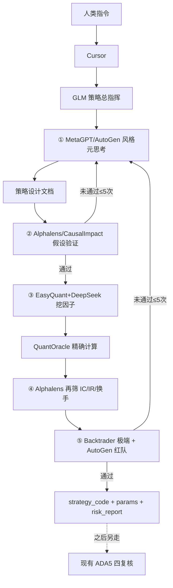

# 策略创造蓝图 v1（不含复核）

人类通过 Cursor 下达「创造策略」后，GLM 作为总指挥调度下列飞轮。**本蓝图止于交付策略包；ADA5 四复核为后续独立环节，代码路径不改动。**

## 架构



## 阶段与模块

| 阶段 | 模块 | 说明 |
|---|---|---|
| ① | `creation_meta_think.py` | 强制发散：3 种微观结构视角 → 择一；四角色设计文档；可选 GLM enrichment |
| ② | `creation_alphalens_lite.py` | **winsorize + neutralize** → IC/IR/换手 + 因果 pre/post |
| ③ | `easyquant_bridge.py` + `creation_deepseek_factors.py` + `quantoracle_bridge.py` | 挖因子 + 确定性认证 |
| ④ | `creation_alphalens_lite.rescreen_candidates` | 再次 winsorize/neutralize；过拟合熔断 |
| ⑤ | `creation_stress_lite.py` | 危机窗口回放 + 对抗冲击 |
| ⑤b/c | `creation_prelim_eval.py` + `creation_return_hardness.py` | 胜率≥50%；周收益代理≥8%；收益/回撤≥1.0；退化熔断 |
| 编排 | `creation_blueprint.py` | 熔断与交付物 |

VPS 未装 alphalens/metagpt/backtrader/autogen 时使用 `*_lite` 可复现适配器；探针会报告真实包是否可用。`winsorize` / `neutralize` 为 Alphalens 有效性底线，轻量适配器中**不得省略**。

## 熔断

1. 迭代次数：②/⑤ 回溯 > 5 → 终止并报告无法构建  
2. 过拟合：IC 衰减过快或换手过高 → 丢弃  
3. VaR 超日损阈值 → 否决  
4. 胜率 < 50% → 禁止展示，换方向/经典变式  
5. **收益硬度**：周收益代理（窗内权益总收益×7/span_days，带杠杆仓位路径）< 8%，或收益/|MDD| < 1.0 → 换视角  
6. **策略退化**：暴露 < 10% / 单笔 < 1bp / 窗内总收益 < 1% → 换视角  
7. **因子多空周收益（带杠杆、扣双边成本）< 3%** → 丢弃（即使 IC 显著）  

设计文档强制字段：`expected_annual_return_range`、`minimum_acceptable_annual_return`；发散视角须带 `max_annual_net_estimate`。

## 入口

```bash
python3 scripts/strategy_create_blueprint.py --symbol ADA-USDT-SWAP --timeframe 5m --brief "..."
python3 scripts/strategy_create_collab.py --symbol ADA-USDT-SWAP --timeframe 5m --brief "..."
```
