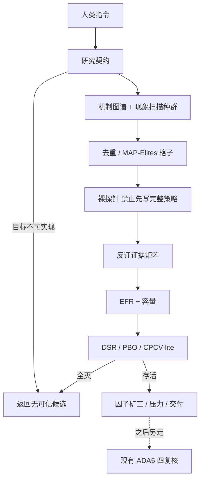

# 策略创造蓝图 v2（研究发现优先，不含复核）

人类通过 Cursor 下达「创造策略」后，系统先跑**研究发现**，再组装候选。**止于交付策略包；ADA5 四复核为后续独立环节。**

## 范式



## 模块

| 阶段 | 模块 | 说明 |
|---|---|---|
| 0 | `research_discovery.compile_research_contract` | 可行性；拒绝被迫交付周收益≥8% |
| 1 | `mechanism_graph` + `phenomenon_scanner` | 理论→数据 与 数据→理论；双向交叉加权 |
| 2 | `map_elites_archive` | 行为格子多样性，不是 Top-N 克隆 |
| 3 | `probe_protocol` | 固定持有/仓位；裸机制无效禁止用退出优化 |
| 4 | `antifalsify` | 负对照/安慰剂/竞争解释；**不宣称因果证明** |
| 5 | `edge_friction` | 早期 EFR；不足不得组装 |
| 6 | `multiple_testing` + `research_ledger` | 试验次数入账；DSR/PBO |
| 7 | 组装（原 ①–⑤ lite） | Meta/知识卡/矿工/QuantOracle/压力/收益硬度 |

## 熔断（更新）

1. 研究发现无存活假设 → **直接无可信候选**（禁止硬凑）  
2. 裸探针失败 → 禁止组装  
3. 反证矩阵 oppose 过多 → 淘汰  
4. EFR < 1.5 → 淘汰  
5. DSR 未过（有效试验次数校正后）→ 淘汰  
6. 收益硬度：默认**年化代理≥6%** + 收益/回撤≥1.0；**已撤销周收益≥8%硬门槛**  
7. CausalImpact-lite 仅作证据降权，**不再当因果一票否决**

## 入口

```bash
python3 scripts/strategy_create_blueprint.py --symbol ADA-USDT-SWAP --timeframe 5m --brief "..."
python3 scripts/strategy_create_collab.py --symbol ADA-USDT-SWAP --timeframe 5m --brief "..."
```

Kimi Judge 槽位已预留但默认未启用（`QIYU_KIMI_ENABLED=0`）。
